# LightGUIAgent 🤖

> Lightweight GUI Automation Agent with Grid-Based Visual Grounding

**A lightweight GUI automation agent based on grid coordinate system and Claude Opus 4.5**

[](https://www.python.org/downloads/)
[](https://github.com/astral-sh/uv)
[](https://www.anthropic.com/)

**Core Innovation**: Divides the screen into a 10×20 grid (similar to chess notation), allowing the model to output "E5" instead of complex pixel coordinates.

## ✨ Key Features

- **🎯 Grid Coordinate System**: 10×20 grid (A-J × 1-20) instead of pixel coordinates
- **🧠 Claude Opus 4.5**: State-of-the-art vision model for UI understanding
- **👁️ Visual Context Memory**: Includes previous step's marked screenshot for better decision-making
- **🌏 Multilingual Support**: Supports Chinese, English, and other languages with perfect input handling
- **⚡ Fast**: 5-8s per step (vs 24-30s with local models)
- **💾 Lightweight**: 200MB RAM (vs 10GB for local models)
- **🚀 Easy Deploy**: No GPU needed, just Python + API key

## 📋 Prerequisites

- Python 3.12+
- [uv](https://github.com/astral-sh/uv) package manager
- Android device with USB debugging enabled
- [ADB](https://developer.android.com/studio/command-line/adb) (Android Debug Bridge)
- Claude API key from [Anthropic](https://console.anthropic.com/)

## 🚀 Quick Start

### 1. Install Dependencies

```bash
# Clone the repository
git clone https://github.com/ReScienceLab/LightGUIAgent.git
cd LightGUIAgent

# Install dependencies (creates .venv automatically)
uv sync

# Or use the convenience command
make dev
```

### 2. Set Up API Key

```bash
# Set Anthropic API key
export ANTHROPIC_API_KEY='your-key-here'

# Or create a .env file (recommended)
cp .env.example .env
# Then edit .env and add your API key

# To persist in shell, add to ~/.bashrc or ~/.zshrc
echo 'export ANTHROPIC_API_KEY="your-key-here"' >> ~/.bashrc
```

### 3. Connect Android Device

```bash
# Enable USB debugging on your Android device
# Connect via USB and authorize computer

# Verify ADB connection
adb devices
```

### 4. (Optional) Customize Configuration

**LightGUIAgent auto-detects your device and screen settings** - zero configuration needed!

For custom configuration:

```bash
cp config.example.yaml config.yaml
# Edit config.yaml to customize grid density, behavior, etc.
```

**Auto-detected:**
- 📱 Device name (via ADB)
- 📐 Screen size (via ADB)
- 🎯 Grid density (calculated for ~108×120px cells)

**Configurable:**
- Grid cols/rows (override auto-calculation)
- Max steps, delay timing
- Grid visual style (colors, line width, label size)
- Inner coordinate labels (show labels inside grid cells)
- Claude API parameters

## 🎮 Usage Examples

### Example 1: Xiaohongshu (Chinese)

Post content to Xiaohongshu social media app:

```bash
make run TASK="打开小红书，发布一个post，内容是 '大家好,我是LightGUIAgent'"
```

**What it does:**
1. Opens Xiaohongshu app
2. Navigates to post creation
3. Types the message "大家好,我是LightGUIAgent"
4. Publishes the post

**Demo Video:**

https://github.com/ReScienceLab/LightGUIAgent/releases/download/untagged-838af5b8d906ee80fc4d/LightGUIAgent-Demo-1.mp4

**📸 Step-by-Step Screenshots:**

<table>
  <tr>
    <td width="33%">
      <b>Step 1: Open Xiaohongshu App</b><br/>
      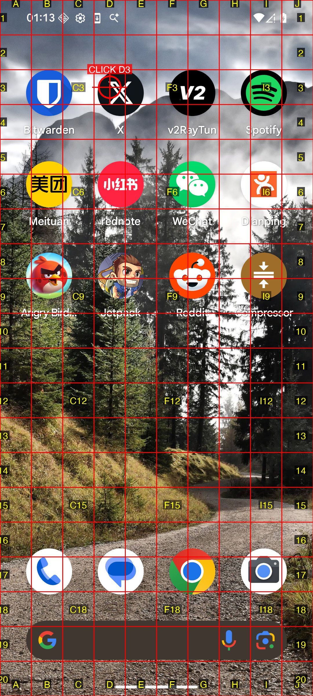
    </td>
    <td width="33%">
      <b>Step 2: Click Create Post Button</b><br/>
      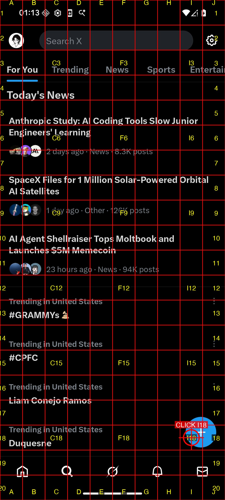
    </td>
    <td width="33%">
      <b>Step 3: Publish Post</b><br/>
      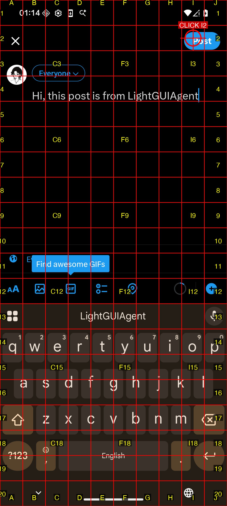
    </td>
  </tr>
</table>

### Example 2: X/Twitter (English)

Post a message to X (Twitter):

```bash
make run TASK="Open X，post 'Hi, this post is from LightGUIAgent'"
```

**What it does:**
1. Opens X app
2. Clicks compose button
3. Types "Hi, this post is from LightGUIAgent"
4. Posts the tweet

**Demo Video:**

https://github.com/ReScienceLab/LightGUIAgent/releases/download/untagged-838af5b8d906ee80fc4d/LightGUIAgent-Demo-2.mp4

**📸 Step-by-Step Screenshots:**

<table>
  <tr>
    <td width="33%">
      <b>Step 1: Open X App</b><br/>
      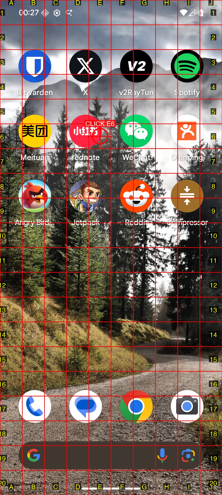
    </td>
    <td width="33%">
      <b>Step 2: Navigate to Compose</b><br/>
      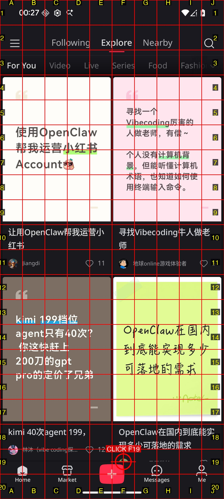
    </td>
    <td width="33%">
      <b>Step 3: Click Compose Button</b><br/>
      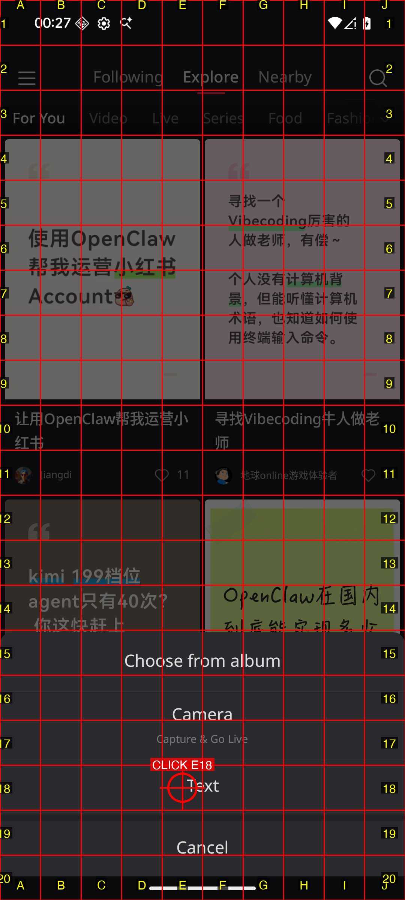
    </td>
  </tr>
  <tr>
    <td width="33%">
      <b>Step 4: Focus on Text Input</b><br/>
      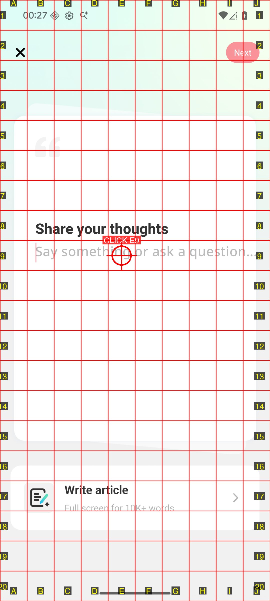
    </td>
    <td width="33%">
      <b>Step 5: Type Message</b><br/>
      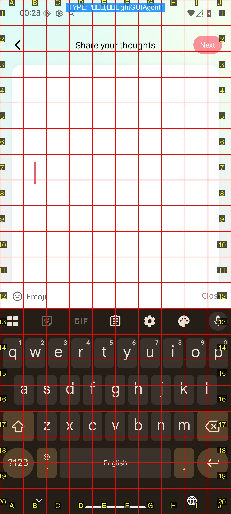
    </td>
    <td width="33%">
      <b>Step 6: Review Content</b><br/>
      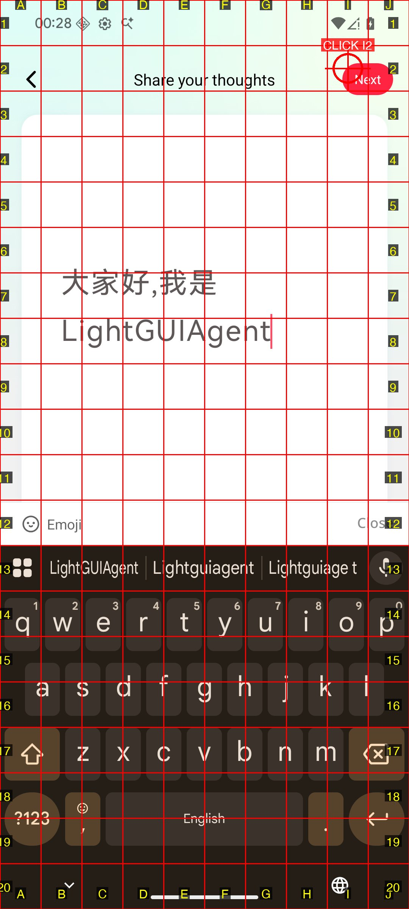
    </td>
  </tr>
  <tr>
    <td width="33%">
      <b>Step 8: Confirm Post</b><br/>
      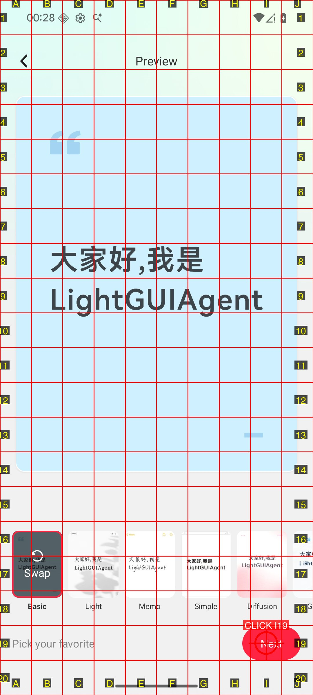
    </td>
    <td width="33%">
      <b>Step 9: Post Published</b><br/>
      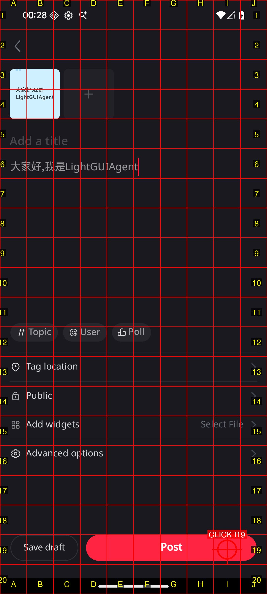
    </td>
    <td width="33%">
      <b>Step 10: Verify Success</b><br/>
      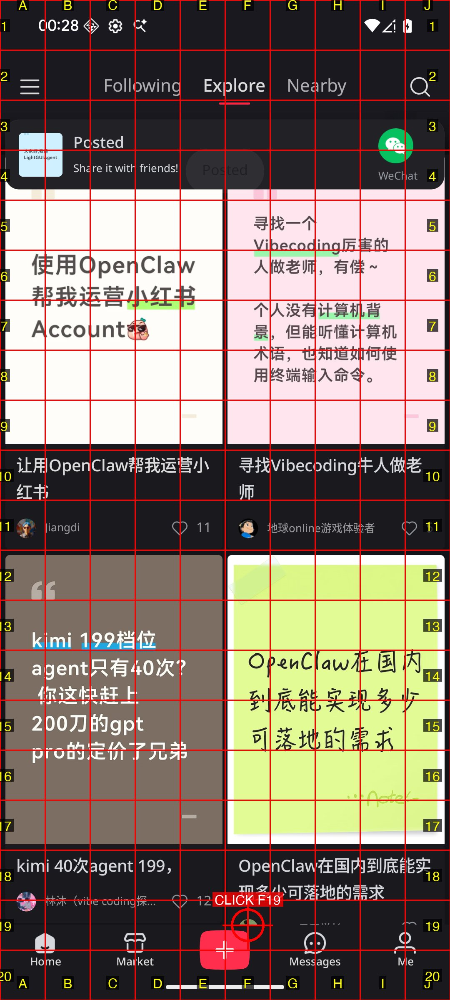
    </td>
  </tr>
</table>

### Additional Usage Methods

```bash
# Method 1: Using Makefile (recommended)
make run TASK="Your task description here"

# Method 2: Using main.py directly
uv run python main.py "Your task description here"

# Method 3: Run tests
make test              # Test grid system
make test-verbose      # Test with verbose output
```

## 📊 Example Output

```
======================================================================
🚀 LightGUIAgent - Intelligent GUI Automation
======================================================================
📋 Task: Open X，post 'Hi, this post is from LightGUIAgent'
🤖 Model: Claude Opus 4.5
🎯 Grid: 10×20 coordinate system (A-J, 1-20)
📁 Log: logs/task_20260202_145623/session.jsonl
======================================================================

LLM Claude Opus 4.5 inference time: 6.18 seconds
Executing command: adb shell input tap 486 540
Step 1 took: 6.92 seconds
Step 1/50 done. Action: CLICK E5 → (486, 540)
  ➤ Click on the X app icon to open it
  📝 Summary: Goal is to open X and post a message. First step: opening the X app from home screen.

LLM Claude Opus 4.5 inference time: 5.87 seconds
Executing command: adb shell input tap 972 2340
Step 2 took: 6.41 seconds
Step 2/50 done. Action: CLICK J22 → (972, 2340)
  ➤ Click the blue '+' button to create a new post
  📝 Summary: X app is open on the Trending page. Now clicking the compose button to create a new post.

LLM Claude Opus 4.5 inference time: 7.19 seconds
Executing command (yadb): adb shell app_process ... -keyboard 'Hi, this post is from LightGUIAgent'
Step 3 took: 7.45 seconds
Step 3/50 done. Action: TYPE "Hi, this post is from LightGUIAgent"
  ➤ Type the post content in the text input field
  📝 Summary: Opened X and started creating a new post, now typing the message content.

...

✅ Task Completed Successfully!

============================================================
📊 Execution Summary
============================================================
Steps completed: 6
Time elapsed:    45.3s
Avg per step:    7.6s
Fastest step:    5.9s
Slowest step:    8.2s

📊 Logger Summary:
   Total events: 28
   Log file: logs/task_20260202_145623/9a3b7c21-4d5e-4a2b-8f3d-2c1e5b6a9d7f.jsonl

💰 Cost Summary
==================================================
Input tokens:  8,420
Output tokens: 624
Total tokens:  9,044
--------------------------------------------------
Input cost:    $0.0421
Output cost:   $0.0156
Total cost:    $0.0577
==================================================
```

## 📊 Performance Comparison

| Metric | Local Models (4B) | LightGUIAgent | Improvement |
|--------|------------------|---------------|-------------|
| **Speed** | 24-30s/step | **5-8s/step** | ⚡ **3-4x faster** |
| **Deployment** | 2 hours | **5 minutes** | 🚀 **24x faster** |
| **Memory** | 10GB | **200MB** | 💾 **50x less** |
| **Accuracy** | ~73% | **~80-85%*** | 📈 **+10%** |
| **Cost** | $0 (GPU required) | **$0.05-0.15/task** | 💰 **Pay-as-you-go** |

\* Estimated based on Claude Opus 4.5 capabilities

## 🎯 Grid System

### Overview

The screen is divided into a **10×20 grid** for easy coordinate reference:

- **Columns**: A-J (10 columns, left to right)
- **Rows**: 1-20 (20 rows, top to bottom)
- **Cell size**: ~108×120 pixels (auto-calculated based on screen resolution)

### Example

```
"E5" → Click center of cell E5 at (486, 540)
```

### Grid Visualization

```
   A    B    C    D    E    F    G    H    I    J
 ┌────┬────┬────┬────┬────┬────┬────┬────┬────┬────┐
1│    │    │    │ 🔍 │    │    │    │    │    │    │ ← Search
 ├────┼────┼────┼────┼────┼────┼────┼────┼────┼────┤
2│    │    │    │    │    │    │    │    │    │    │
 ├────┼────┼────┼────┼────┼────┼────┼────┼────┼────┤
3│    │  [Button]  │    │    │    │    │    │    │   ← UI Element
 ├────┼────┼────┼────┼────┼────┼────┼────┼────┼────┤
4│ 📱 │    │    │    │ 📧 │    │    │    │    │    │ ← Apps
 ├────┼────┼────┼────┼────┼────┼────┼────┼────┼────┤
...
```

### Inner Coordinate Labels

LightGUIAgent supports semi-transparent coordinate labels inside grid cells for easier identification:

**Configuration (config.yaml):**
```yaml
grid:
  show_inner_labels: true     # Enable inner labels
  inner_label_interval: 3     # Show label every 3 cells
  inner_label_opacity: 128    # Semi-transparent (0-255)
```

**Options:**
- `inner_label_interval: 1` - Show label in every cell (dense)
- `inner_label_interval: 2` - Show label every 2nd cell
- `inner_label_interval: 3` - Show label every 3rd cell (default, balanced)

This helps Claude identify coordinates in the center of the screen without needing to infer from edge labels.

## 🔧 Architecture

### Components

- **config.py** - Configuration management with auto-detection
- **settings.py** - Settings model with validation
- **grid_converter.py** - Grid ↔ Pixel coordinate conversion
- **grid_overlay.py** - Screenshot annotation with grid overlay
- **claude_client.py** - Claude API integration with vision support
- **agent.py** - Main orchestration loop
- **logger.py** - JSONL logging system with detailed metrics

### Workflow

1. **Capture** - Take screenshot via ADB
2. **Annotate** - Add grid overlay with coordinate labels
3. **Compress** - Resize to optimal size for Claude API
4. **Analyze** - Claude decides next action based on visual context
5. **Execute** - Perform action via ADB (tap, type, scroll, etc.)
6. **Log** - Record step details in JSONL format with screenshots
7. **Repeat** - Until task completes or reaches max steps

### Available Actions

1. **CLICK** - Tap on a grid position (e.g., "E5")
2. **TYPE** - Enter text into focused input field
   - Supports Chinese, emoji, and special characters via yadb
   - Optional `clear_first` to clear existing text
3. **SCROLL** - Scroll up or down on the screen
4. **AWAKE** - Launch an app by package name
5. **COMPLETE** - Mark task as successfully completed


## 🐛 Troubleshooting

### API Key Issues

```bash
# Verify API key is set
echo $ANTHROPIC_API_KEY

# Or check .env file
cat .env | grep ANTHROPIC_API_KEY
```

### ADB Issues

```bash
# Restart ADB server
adb kill-server && adb start-server

# Check device authorization
adb devices  # Should show "device" not "unauthorized"

# If device shows offline
adb reconnect
```

### Grid Not Visible

- Check `artifacts/logs/task_*/images/*_annotated.jpg` files
- Verify screen resolution is detected correctly
- Adjust grid colors in `config.yaml` if needed:
  ```yaml
  grid:
    line_color: [0, 255, 0]  # Change to green
    label_color: [255, 0, 0]  # Change to red
  ```

### Duplicate Click Detection

If the agent repeatedly clicks the same position:
- The system now detects repeated clicks and warns Claude
- Check `delay_after_action` in config (increase if UI transitions are slow)
- Review marked screenshots to see if UI actually changed

## 📁 Project Structure

```
LightGUIAgent/
├── main.py                  # Entry point
├── lightguiagent/           # Main package
│   ├── agent.py            # Main orchestrator
│   ├── claude_client.py    # Claude API client
│   ├── grid_overlay.py     # Grid visualization
│   ├── grid_converter.py   # Coordinate conversion
│   ├── config.py           # Configuration management
│   ├── settings.py         # Settings model
│   └── logger.py           # JSONL logging
├── tests/                   # Test suite
│   └── test_grid_system.py
├── examples/                # Demo videos
│   ├── LightGUIAgent-Demo-1.mp4
│   └── LightGUIAgent-Demo-2.mp4
├── artifacts/               # Generated outputs
│   ├── logs/               # Task execution logs
│   └── debug/              # Debug screenshots
├── bin/                     # Helper binaries (yadb)
├── config.yaml              # User configuration
├── config.example.yaml      # Configuration template
├── pyproject.toml           # Dependencies
├── Makefile                 # Convenience commands
└── README.md
```

## 📚 References

- [Claude API Documentation](https://docs.anthropic.com/)
- [ADB Documentation](https://developer.android.com/studio/command-line/adb)
- [uv Package Manager](https://github.com/astral-sh/uv)

## 📝 License

This project is licensed under the Apache License 2.0 - see the [LICENSE](LICENSE) file for details.